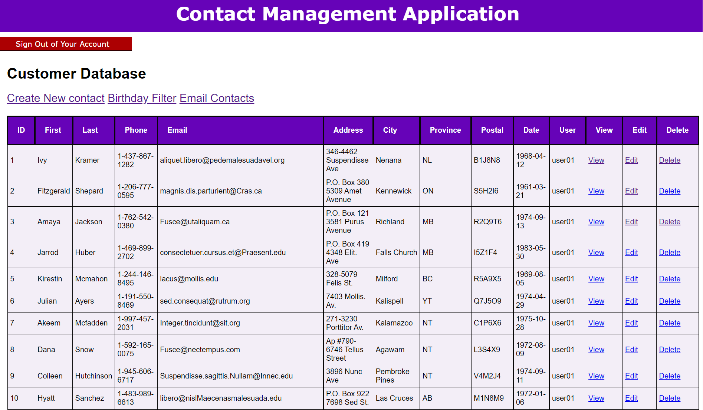

# 

# WEBD 3000 - PHP Programming Project:

## CMS Application PHP

This application is written in PHP and incorporates a MySQL database in PHPMyAdmin.

Please ensure you have PHP and MySQL installed before running this application! 

# Login Credentials

| USERNAME | PASSWORD |
|----------|----------|
| admin    | password |
| user01   | password |

### If Successful, you should see the album running in the new broswer.

